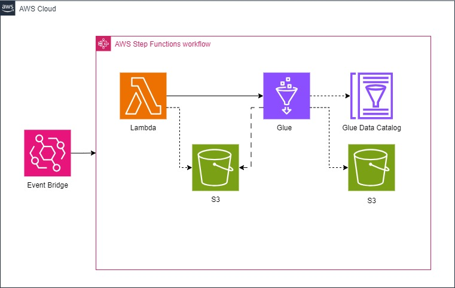

データ収集部分は[こちらのリポジトリ](https://github.com/gooooya/scraping_Terraform_AWS/tree/master)を参照  
  
# 目的  
取得したデータを分析できる形式に変換する

# 構成図

# システム要件
以下の環境での動作を確認しました。
- **windows10**
- **Docker Desktop**
- **AWS CLI**
- **環境変数:**
  - AWS_ACCESS_KEY_ID AWSの公開鍵
  - AWS_SECRET_ACCESS_KEY AWSの秘密鍵
  - TF_VAR_bucket_name バケット名(任意)

# 動作内容
7日ごとに中古マンションの販売情報から名称,価格,面積,住所,駅情報,レイアウト,築年月,URL,取得時刻を取得し、S3に格納する。  
格納したデータを機会学習を行えるよう形式を変換する。  
取得したデータ以外をbuckupに格納する(outputsの中身を最新のデータのみにする)  
